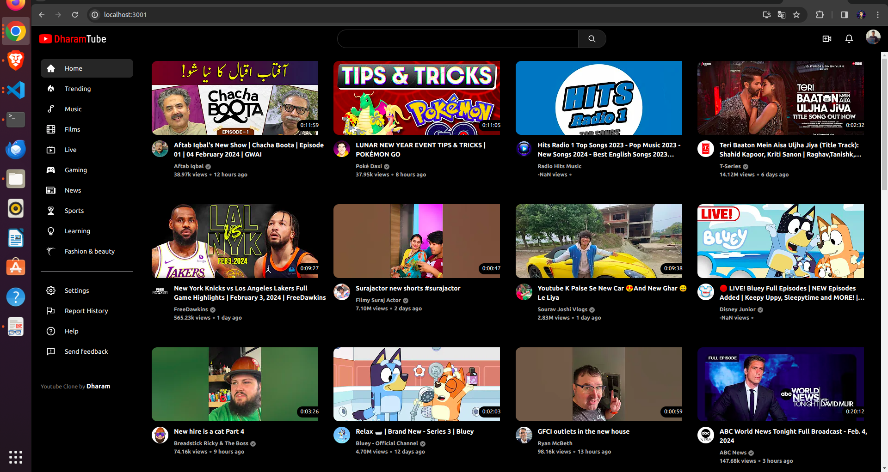

# YouTube Clone with React.js

This project is a clone of YouTube built using React.js. It utilizes the RapidAPI for data retrieval and Tailwind CSS for styling. The application includes various functionalities such as video search, playback, and full responsiveness.

## Features

- Search for videos
- Play videos
- Fully responsive design

## Technologies Used

- React.js
- RapidAPI
- Tailwind CSS

## Screenshots

## Getting Started

To get a local copy up and running, follow these simple steps:

1. Clone the repository from GitHub:

git clone https://github.com/Dharam-IN/Youtube-Clone-React.git

2. Install dependencies:

3. Start the development server:

4. Open your browser and navigate to `http://localhost:3000` to view the application.

## Contributing

Contributions are welcome! Feel free to fork the repository and submit pull requests.

## License

This project is licensed under the MIT License - see the [LICENSE](LICENSE) file for details.

## Acknowledgements

- Thanks to RapidAPI for providing access to the YouTube API.
- Special thanks to the Tailwind CSS community for their amazing framework.
